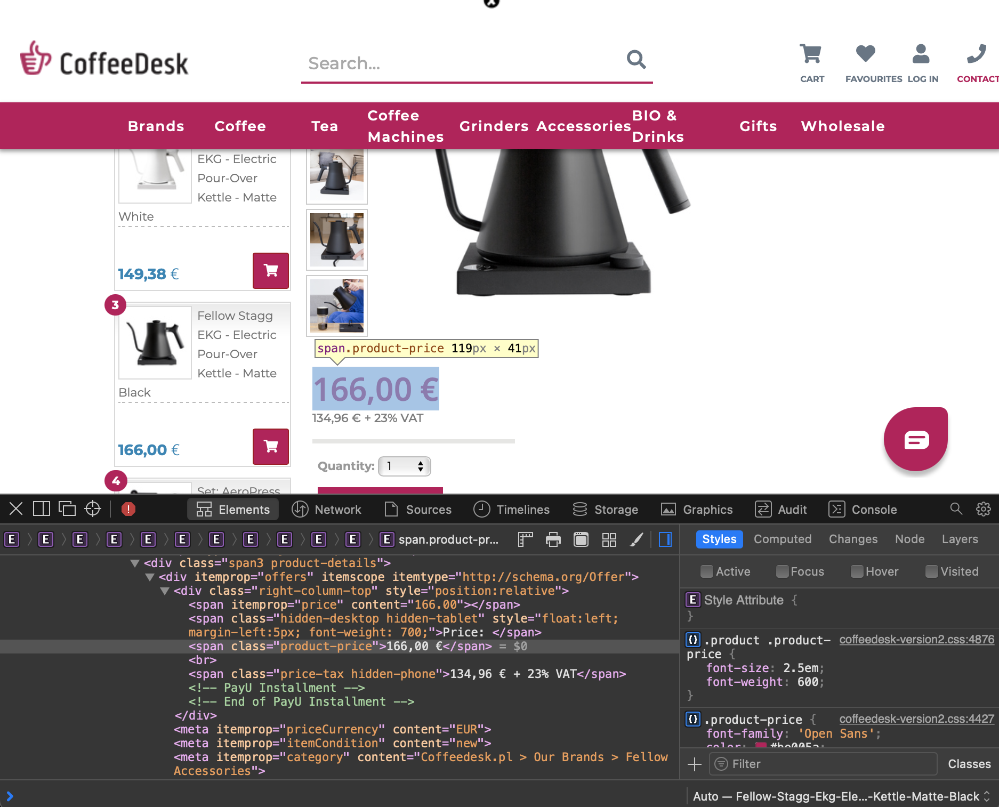

# Getting price changes on your email using BeautifulSoup

### Alvaro Aguirre - November, 2020

I'm sure there is some product online that you have had your eye on for a while. Maybe you're just waiting for the price to drop to buy it. In my case, I have been obsessed with <a href="https://fellowproducts.com/products/staggekg" target = "_blank">Fellow's Stagg EKG Kettle</a> for a couple of weeks now. It's the ultimate kettle for coffee brewing, but the elevated price tag puts me off from pulling the trigger on it. Since I wanted to keep learning some basic Python I thought why not create a simple script that checks the price daily, and sends me an email if it has gone down.

#### Libraries

The libraries we are going to use for this are `requests`, `bs4`, `smtplib` and `ssl`. If you don't have any installed, and have `pip`, you can run, for example:

````python
pip install bs4
````

Once you have them all installed, let's load them:

````python
import requests, smtplib, ssl
from bs4 import BeautifulSoup
````

#### Webscrapping

We are going to use `BeautifulSoup` to access the website of a store that is selling the product, parse the html content, and extract the price. In my case, the product is sold by <a href = "https://www.coffeedesk.com" target="_blank">CoffeeDesk</a>, a Polish retailer that fulfills Fellow products for Europe.

With `BeautifulSoup`, we can easily find elements of a website using their HTML tags, ids, or classes. A good way to find what you are looking for, is through the *Inspect Element* option of your web browser. You can right-click on the element you are interested it, select *Inspect*, and identify the HTML element. For example, in my case, the price is located in an object of type `span`, that has the class `product-price`:



Now we can make a simple HTTP request using the `requests` library. Then, we will use the `html.parser` to read the contents of the page. Finally, we will use `soup.find` to extract the element of the page we are interested in, the price. Note that this element will be extracted as a string. I will then format and transform it into a float so I can evaluate if it has increased or decreased.

````python
# Store the contents of the url
page = requests.get("https://www.coffeedesk.com/product/8558/Fellow-Stagg-Ekg-Electric-Pour-Over-Kettle-Matte-Black")

# Use BeautifulSoup to parse it
soup = BeautifulSoup(page.content, 'html.parser')

# Use the product-price class to find the current price, and format it into a float
price = float(soup.find('span', class_ = 'product-price').text.split(" ")[0].replace(",","."))
````

Nice! Now we have an object called `price` that holds the current price of the item. Since this code will run in a server daily, we want to receive an email in case the price has gone down. This just means a simple `if` condition. You can save and update the price object every day, and compare today's value with yesterday's value. Or, if you want a more straightforward solution, we can directly write the conditional in terms of the current price. Right now, this item is 166€, so I will do:

````python
if price < 166:
    #Send me an email
````

#### Sending the email

Using the `smtplib` and `ssl` libraries, we will open a client sesison that allows us to send emails with Python. Let's prepare the email with the necessary objects:

````python
# Select a port
port = 465

# Choose a server, I will be sending it from a gmail account
smtp_server = "smtp.gmail.com"

# Email of the sender account
sender_email = "Enter the sender email here"

# Email of the receiver account
receiver_email = "Receiver email here"

# Password for the sender email
password = "Your password"

# Message to be sent
message = """\
Subject: Fellow EKG for sale!

Hi Alvaro, 

This is Alvaro from the past.
If you are getting this, it means that the Fellow EKG is on sale on Coffeedesk.
The new price is """ + str(price) +""" euros.
Here is the link in case you want to get it:

https://www.coffeedesk.com/product/8558/Fellow-Stagg-Ekg-Electric-Pour-Over-Kettle-Matte-Black

Hopefully it's a good deal!

Cheers,
Alvaro
"""

# Create SSL object
context = ssl.create_default_context()
````

And now we are ready. If the `price` object is lower than 166, we will initialize the server using `smtplib`, login with the `sender_email` and `password`, and use `sendmail()` to send the message:

````python
# Send the email if the price is lower than retail price
if price < 166:
    with smtplib.SMTP_SSL(smtp_server, port, context=context) as server:
        server.login(sender_email, password)
        server.sendmail(sender_email, receiver_email, message)
````

#### Uploading the code to a server

We are all done! We can save all the code on a `.py` file, like I have done <a href = "webscrap/OnSale.py" target = "_blank">here</a>. Whenever you run the file, the program will check for the current price on the website, and if it is lower than what you specified, it will send you an email. Of course, this involves having to run the code. If we were to manually do this it would be completely useless, since in the same time you could open the URL and check for yourself. What I have done is uploaded the Python file to my AWS EC2, and created a `cron` job that runs the code automatically every day at noon. So, regardless if I'm at home, at work, walking, with the computer on or off, etc, the code will be executed daily.

To program a `cron` job, you need to add the job to your `crontab`, you can access it from your terminal:

````bash
crontab -e
````

And once the crontab file opens, write:

````bash
0 12 * * * python3 myfile.py
````

The code simply means that every day at noon, the program `myfile.py` will be executed. If you want some tips on how to schedule `cron` jobs, this page is quite helpful: <a href = "https://crontab.guru" target = "_blank">https://crontab.guru</a>