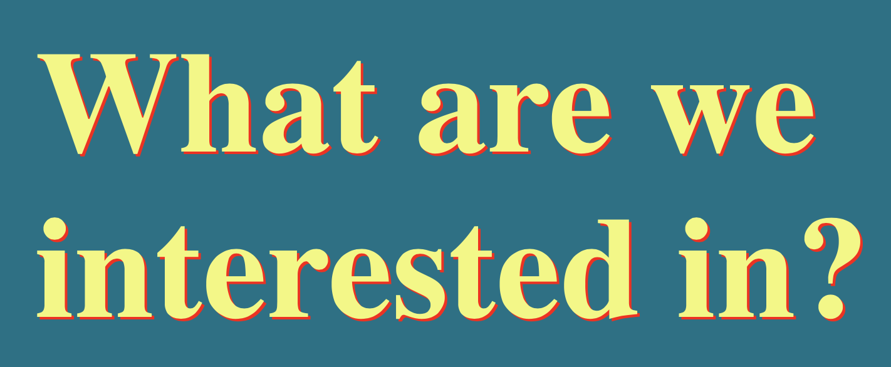

## Projects

Some small projects I have been working on.

### What are we interested in?

While in quarantine, [Hannah Ker](https://hannahker.com) and I decided to do some little projects to learn new skills, each taking only a couple of hours long. The first one was [_What are we interested in?_](https://alvaroaguirre.github.io/whatareweinterestedin/), a simple website that uses JavaScript to get the top ten Wikipedia articles read the previous day, and scale each one's font size by its relative page views. The code can be found [here](https://github.com/alvaroaguirre/whatareweinterestedin).

### Daily Covid tracking using AWS

I built a Python program that gets daily new cases and deaths, both in absolutes and 7-day rolling averages, and generates a plot that shows the evolution for Peru, Spain and the UK (my home country and the two countries where I have been living for the past couple of years). Since I wanted to learn about AWS, I initialized an EC2 instance and stored the code there, along with a bash script that runs it and pushes results to github daily according to a cron schedule. The plots can be found [here](https://alvaroaguirre.com/covid).

### Benford's Law

I recently learned about [Benford's Law](https://en.wikipedia.org/wiki/Benford%27s_law) and could not believe it was real. It basically says that the distribution of the leading digit of real-world data is not uniform, as one would expect, regardless of the unit measured, and it actually always has the same distribution. I used two datasets to test this. First, I downloaded daily stock prices for all US publicly traded stocks during 2019, almost 2 million observations. Then, I downloaded the Covid-19 dataset from [Our world in data](https://ourworldindata.org/). Using Python with Pandas and Numpy, I got the distribution of leading non-zero digits and... Benford's Law holds! Below is a one of the distribution plots I generated. I wrote a more detailed blog post [here](./blog/benford/benfords_law.html).

### Numerical computing language speed: R, Julia, Matlab and Python

I wrote an article with Jon Danielsson published in [Vox EU](https://voxeu.org/article/which-programming-language-best-economic-research) about the speed of numerical computing languages for finance. We wanted to test R, Julia, Matlab and Python and performed various benchmark tests. For example, we read a large dataset both compressed (~1GB) and uncompressed (~8GB), which includes all the CRSP database. R's data.table package was unparalled for this task. We also performed a GARCH log-likelihood calculations and compared the computing time with a code we wrote in C. Here Julia and Matlab beated base R and base Python, but when decorating R with Rcpp and Python with Numba, these were the fastest. We also included a test on performing group calcuations on the large dataset. You can find all the details in [this](https://github.com/alvaroaguirre/Projects/tree/master/Speed) github repository. 

### Chaotic Art 

I have always been fascinated by the beauty and aesthetics found in mathematics. During my time at the LSE I discovered Chaos Theory, and realized that playing around with different dynamical systems and delay plots could generate beautiful pieces. Here are some examples, you can find more details [here](https://github.com/alvaroaguirre/NonLinearDynamics/tree/master/ChaoticArt).

The pieces shown below are (in order):  
_Unravelling_  
_Lorenz's Coccon_  
_Ikeda's eye_  

### Collatz's Contrapunctus

Reading "Gödel, Escher, Bach" by Douglas Hofstadter made me think a lot about the intersection of mathematics and music. Vulfpeck released a music video called ["Bach Vision Test"](https://www.youtube.com/watch?v=vJfiOuDdetg), which beautifully shows a visual representation of *Die Kunst der Fuge, Contrapunctus IX, a 4 alla Duodecima*, a four-voiced fugue, where each one is represented by a colored line on a black background, moving up and down following the melody. While reading the book, I regained interest in Collatz's Conjecture, which I had initially learnt about during a lunch with a mathematician friend a few years ago. I found the plot of stopping times amusing, and for small integers (<300), the plot semeed to have two "voices". So following Vulfpeck's idea, I animated stopping times with two voices as if it was a counterpoint or fugue, and wrote some code in R that transform Collatz's stopping numbers into musical notes and plays a melody with them. You can find the code [here](https://github.com/alvaroaguirre/Projects/blob/master/collatz_music.R).

I wonder if Lothar Collatz was a fan of Bach:

### Outlook cleaner for Mac

I use the Outlook app for my mac, and after some "Disk is almost full" messages, realized that it had been written several GB (I've had the same email for around 14 years!). Basically, Outlook downloads messages and attachments in your computer, and there is no option to only keep downloaded emails from the last X days. I have been trying to learn some more Python so I wrote a little program that deletes all hidden Outlook files older than a year (you can change this to any number of days). Note that this does not delete any emails, only the downloaded data on your computer, you can still access those messages online and re-download them anytime. You can find the program [here](https://github.com/alvaroaguirre/Projects/tree/master/Outlook_cleaner).

### Credit data from the Bank for International Settlements

I built an R notebook that automatically downloads data from the Bank for International Settlements using an API and creates functions to easily make plots for credits to the non-financial sector, including: government, households, private non-fin, non-fin corporations, non-fin sector, both for single countries or groups of countries. You can find the notebook [here](https://github.com/alvaroaguirre/Projects/tree/master/BIS), and a sample plot:

### Simple Whatsapp conversation analysis with Python

I find natural language data very interesting, especially after reading Ben Blatt's _Nabokov's favorite word is mauve_. You can easily export chats from the Whatsapp app, so I wrote some basic Python code that plots daily messages sent, groups them by sender, checks the average message length, and finally gives you the most common words used by sender, excluding stopwords. Try it with your own chat [here](https://github.com/alvaroaguirre/Projects/blob/master/Whatsapp/whatsapp.ipynb).

### Building Sierpiński triangles 

Fractals are incredibly soothing. After watching [this video](https://www.youtube.com/watch?v=kbKtFN71Lfs) from Numberphile, I decided to write a simple code that uses a chaotic game algorithm to draw Sierpiński triangles from randomly selected initial points. [Here](https://github.com/alvaroaguirre/NonLinearDynamics/blob/master/sierpinski.R) you can find the code and run it. Every time you will get a different fractal.

### Project Euler

I enjoy logic puzzles and math challenges, so when I found out about [Project Euler](https://projecteuler.net), I was thrilled. 

In [this](https://github.com/alvaroaguirre/Project_Euler) github repository you will find my solutions for some problems, written in Python. I plan on keep adding solutions there. If you would like us to work on a problem together, I would love to. Please email me and we can arrange a meeting.

### Contests with Uncertainty on Success Functions

Microeconomic models on Contest Theory in recent years have introduced asymmetries in costs, valuations, and information. However, most of them take for granted that the map from the vector of efforts to the probabilities of winning, known as the Contest Success Function, is part of the agents' common knowledge. For my bachelors' thesis I built a simple model adding a stochastic component in the CSF, plus information asymmetries between the participating agents, and proposed an application to electoral competitions. The paper was published in the Volume VII of the [Berkeley Economic Review](https://econreview.berkeley.edu)

